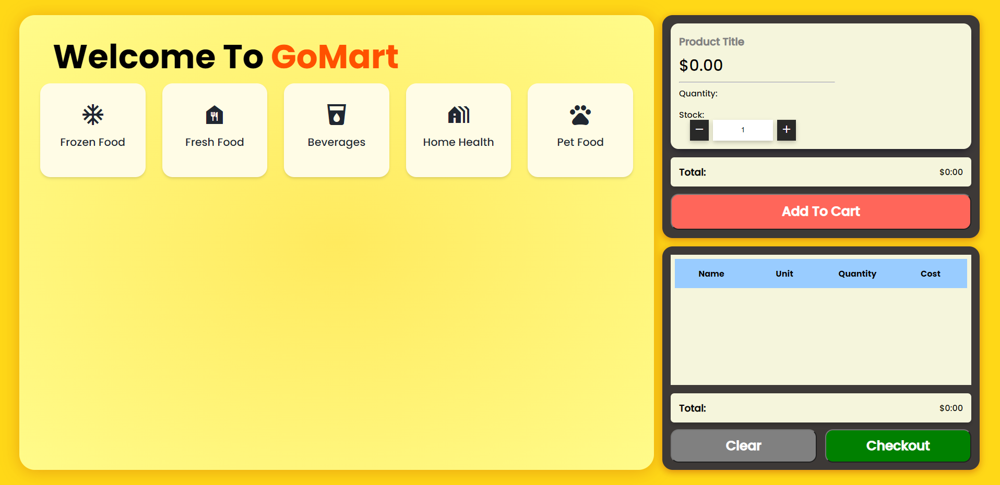

# UTS31748_Assignment_1


## About the project

#### 1. Introduction

This website was developed as an assignment project for the UTS: Programming on the Internet subject. It focused on creating a website that focuses on processing data stored in 
a mysql server utilising php and javascript to produce information that users can read. 




## Dependencies

* [PHP 7.3](https://www.php.net/)
* [MySQL](https://www.mysql.com/downloads/)

<!-- 
## Setup

These are the steps to compile `Main.java` and run the program `Main`. Source code is found in the src folder. These steps are for use with command line workflow such as with a terminal.

1. Sign up for a GitHub account if you don't have one. Set up your SSH keys with github.
2. Clone this repository `git clone git@github.com:cisc3130-s20/assignment-template.git` to your machine to get a copy.
3. Move into the project's root directory with `cd assignment-template` [^1]
4. Move again into the subdirectory `src` using the command `cd src`
5. Compile the java file using the java compiler command `javac Main.java`
6. Run the compiled java program with the java command `java Main`

You should see an output similar to the following:

```sh
$ javac Main.java
$ java Main
Hello World
```

-->
